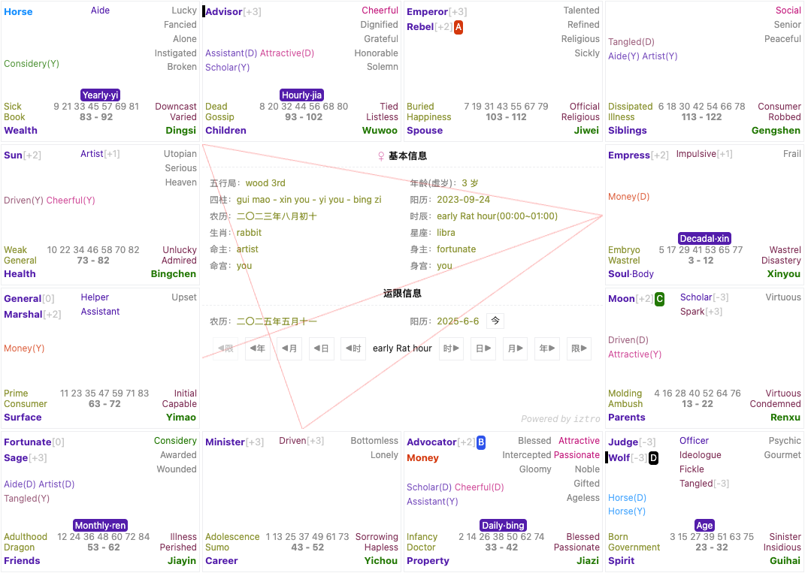

<div align="center">


# A lightweight astrolabe generator of The Purple Star Astrology (Zi Wei Dou Shu)

[简体中文](./README.md) 🔸 [繁體中文](./README-zh_TW.md) 🔸 English

</div>

<div align="center">

  [](https://www.npmjs.com/package/iztro)
  [](https://www.npmjs.com/package/iztro)
  [](https://www.npmjs.com/package/iztro)
  [](https://www.jsdelivr.com/package/npm/iztro)

  [](https://github.com/SylarLong/iztro)
  [](https://github.com/SylarLong/iztro/actions/workflows/Codecov.yaml)
  [](https://github.com/SylarLong/iztro/actions/workflows/Codecov.yaml)

  [](https://codeclimate.com/github/SylarLong/iztro/maintainability)
  [](https://packagequality.com/#?package=iztro)

  [](https://www.npmjs.com/package/iztro)
  [](https://app.fossa.com/projects/git%2Bgithub.com%2FSylarLong%2Fiztro?ref=badge_shield)

</div>

## Introduction

It's used to obtain the data of `The Purple Star Astrology (Zi Wei Dou Shu)`.

- Input

  - birthday（support solar date and lunar date）
  - birth time
  - gender

- Feature list

  - get `12 palaces` data of Zi Wei Dou Shu.
  - get Chinese `zodiac`
  - get `sign`
  - get birth time by Chinese date
  - get `horoscope`(`decadal`, `turnly`, `yearly`, `monthly`, `daily`, `timely`)
  - get horoscope `stars` (`dacadal` and `yearly`)
  - check if one `palace` includes specific `stars`
  - check if `surrounded palaces` of specific `palace` include specific `stars`
  - check if `surrounded palaces` of specific `palace` include specific `mutagen`
  - check if spedific star is `mutaged`
  - check if `surrounded palaces` of specific `star` include specific `mutagen`
  - check star `brightness`
  - get `mutagen` by `heavenly stem`
  - get `palace` by `star`
  - get `surrounded palaces` by `palace`
  - get `surrounded palaces` by `star`
  - get `opposite` palace by `star`

- Other

  - Multilingual input/output

    you can mix multiple languages when passing parameters and specify output language. we support Simplified Chinese, Traditional Chinese, English, Japanese, Korean and Vietnamese. however, English translation is not stardand. so I just translate them by meaning. if you're good at English and well known about Zi Wei Dou Shu, welcome to PR. any language is welcome.

  - Chain invoking

    if you want to check if the `surrounded palaces` of  `emperor` is `focused`, you can do it like this:

    ```ts
    import { astro } from 'iztro';

    const astrolabe = astro.bySolar('2000-8-16', 2, 'male', true, 'en-US');

    astrolabe.star('emperor').surroundedPalaces().haveMutagen('focused');
    ```

  - Configuration and plugins

     There are many `Zi wei Dou Shu` genres, and the mutagens and star brightness of different genres will be slightly different. In order to meet the needs of different genres and function expansion, iztro has added global configuration and third-party plug-in functions in version `v2.3.0`. For details, see [Configuration Document](https://ziwei.pro/posts/config-n-plugin.html)

## Quick Links

- [Document](https://docs.iztro.com)
- [Discussions](https://github.com/SylarLong/iztro/discussions)
- [Issues](https://github.com/SylarLong/iztro/issues)
- [Demo](https://ziwei.pub)

## Online Demo

To instantly access iztro's astrolabe with no development required, go directly to https://ziwei.pub for online demo.

## Installation

You can choose any package manager to install `iztro`.

```shell
# npm
npm install iztro -S

# yarn
yarn add iztro

# pnpm
pnpm install iztro -S
```

## Simple Example

This is a very simple example to show how to use `iztro` to get the astrolabe data. please visit [develop document](https://docs.iztro.com) for details.

- ES6 Module

  ```ts
  import { astro } from 'iztro';

  // get astrolabe data by solar date
  const astrolabe = astro.bySolar('2000-8-16', 2, 'male', true, 'en-US');

  // get astrolabe data by lunar date
  const astrolabe = astro.byLunar('2000-7-17', 2, 'male', false, true, 'en-US');
  ```

- CommonJS

  ```ts
  var iztro = require('iztro');

  // get astrolabe data by solar date
  var astrolabe = iztro.astro.bySolar('2000-8-16', 2, 'male', true, 'en-US');

  // get astrolabe data by lunar date
  var astrolabe = iztro.astro.byLunar('2000-7-17', 2, 'male', false, true, 'en-US');
  ```

## Contributing

If you're interested in `iztro` and wish to join us,it's very welcome. You can contribute by:

- create an issue [here](https://github.com/SylarLong/iztro/issues/new?assignees=SylarLong&labels=%E5%8A%9F%E8%83%BD%EF%BD%9Cfeature&projects=&template=new-feature.md&title=%7B%E6%A0%87%E9%A2%98%7D%EF%BD%9C%7Btitle%7D) if you have any good ideas or suggestions.
- report a bug [here](https://github.com/SylarLong/iztro/issues/new?assignees=SylarLong&labels=%E6%BC%8F%E6%B4%9E%EF%BD%9Cbug&projects=&template=bug-report.md&title=%7Bversion%7D%3A%7Bfunction%7D-) if you found any bugs.
- you can also `fork` this code to your repository and create PRs for your changes.
- also, you can contribute the `localization` files. please refer to [locales](https://github.com/SylarLong/iztro/tree/main/src/i18n/locales) and create the localization files for your lanuage.
- additionally, buy me a coffee is another great way to support me [](https://PayPal.Me/sylarlong)

> [!NOTE]
> Please read the [Contributing Guide](https://github.com/SylarLong/iztro/blob/main/CONTRIBUTING.md) before starting.

## Summary

You can generate an astrolabe by using the returned data. Of course it's just an example. You can focus on astrolabe design or data analyzation. This program solves the most tedious work for you, so that you can put more energy on the things you need to pay attention to.



## Star History

<a href="https://star-history.com/#sylarlong/iztro&Date">
  <picture>
    <source media="(prefers-color-scheme: dark)" srcset="https://api.star-history.com/svg?repos=sylarlong/iztro&type=Date&theme=dark" />
    <source media="(prefers-color-scheme: light)" srcset="https://api.star-history.com/svg?repos=sylarlong/iztro&type=Date" />
    
  </picture>
</a>

## License

[MIT License](https://github.com/SylarLong/iztro/blob/main/LICENSE)

Copyright &copy; 2023 All Contributors.

[](https://app.fossa.com/projects/git%2Bgithub.com%2FSylarLong%2Fiztro?ref=badge_large)
