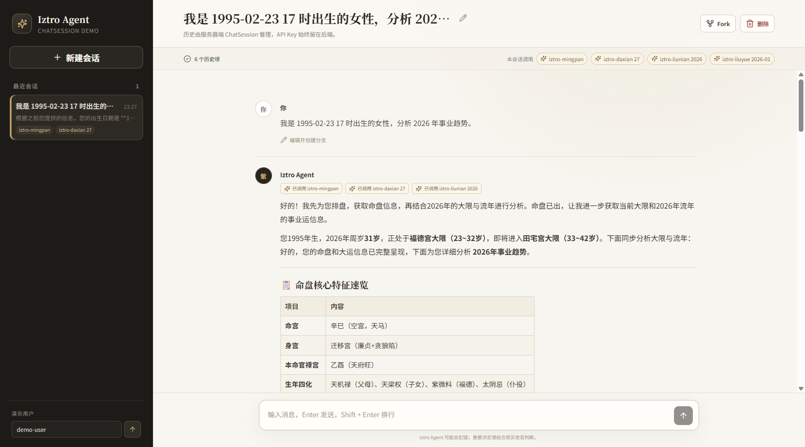
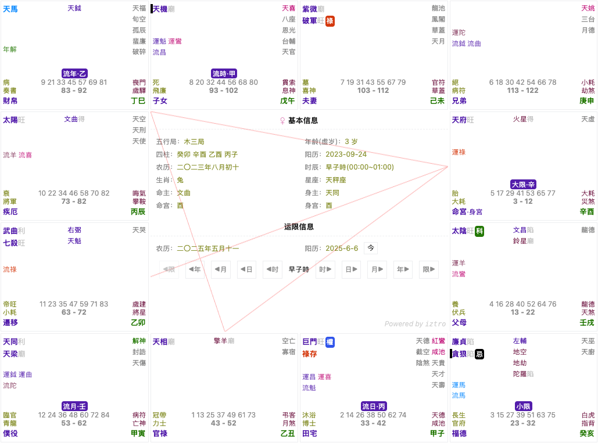

<div align="center">


# 一套輕量級紫微鬥數排盤工具庫

[简体中文](./README.md) 🔸 繁體中文 🔸 [English](./README-en_US.md)

[](https://discord.gg/xvmu6gww6B)

</div>

<div align="center">

  [](https://www.npmjs.com/package/iztro)
  [](https://www.npmjs.com/package/iztro)
  [](https://www.npmjs.com/package/iztro)
  [](https://www.jsdelivr.com/package/npm/iztro)

  [](https://github.com/SylarLong/iztro)
  [](https://github.com/SylarLong/iztro/actions/workflows/Codecov.yaml)
  [](https://github.com/SylarLong/iztro/actions/workflows/Codecov.yaml)

  [](https://qlty.sh/gh/SylarLong/projects/iztro)
  [](https://packagequality.com/#?package=iztro)

  [](https://www.npmjs.com/package/iztro)
  [](https://app.fossa.com/projects/git%2Bgithub.com%2FSylarLong%2Fiztro?ref=badge_shield)

</div>


## iztro AI · 紫微與奇門模型

除了開源排盤庫，`iztro` 還提供兩個託管的專業 AI 模型。它們會自動調用服務端術數工具，並透過 Chat API 或 Iztro Agents SDK 接入；你不需要自行維護排盤提示詞，也不必讓通用模型猜測盤面。

| 模型 | 適合的問題 | 需要提供 |
| --- | --- | --- |
| **`iztro-ziwei-v3`** | 本命性格、人生格局、兩人適配度，以及大限、流年、流月、流日等中長期趨勢 | 出生日期、出生時間、性別和分析主題 |
| **`iztro-qimen-v3`** | 一件當下具體事情的決斷、發展、阻力與應期，例如合作、談判、面試、上線、出行或關係中的下一步 | 事情背景、一個明確問題和問事時刻；**不需要出生資訊** |

### `iztro-ziwei-v3`：命盤與長期趨勢

- 自動調用 `iztro` 排盤工具，按問題讀取本命、大限、流年、流月、流日等必要層級。
- 針對紫微解讀優化提示詞與推理策略，並可在會話中記住出生資訊和此前上下文。

### `iztro-qimen-v3`：一事一局的決斷與應期

- 先調用託管工具 `qimen-qigua`，根據問事時刻為**一件具體事情**起局，結合九宮、天地盤、神、星、門、空亡與馬星等證據判斷。
- 當使用者問「什麼時候」或時間是結論關鍵時，模型會在選定用神後繼續調用 `qimen-yingqi`，計算真實日曆中的候選觸發時間。
- 一事一局：互不相關的事情應分開提問。應期日期是結合全局解讀的觸發候選，不是「某天必然成功」的保證。

例如，一個清楚的奇門問題是：「我們已經談過兩次渠道合作，但分成和上線時間還沒定。現在應該推進、繼續談，還是暫緩？如果可以推進，請給出最近的行動窗口和依據。」

> [!NOTE]
> NPM 套件 `iztro` 本身仍是開源的**紫微斗數排盤庫**；`iztro-qimen-v3` 是透過 API/Agents SDK 使用的託管 AI 模型，不是本地奇門排盤模組。

兩個模型都支援以下接入方式：

### 1. iztro Chat API —— 調用我們的 HTTP API

如果你需要紫微或奇門對話能力，可以使用 iztro Chat API。使用時需要 API key，你可以在[開發者文檔](https://api-doc.iztro.com)查看完整介面，並閱讀專門的[奇門模型指南](https://api-doc.iztro.com/sdk/qimen)。

以下範例假設你已把控制台產生的密鑰保存到服務端環境變數 `ZIWEI_API_KEY`。不要把密鑰寫入瀏覽器程式碼。

推薦的集成方式是多輪對話 API：先創建會話，再向該會話發送使用者訊息。這樣 API 可以為你保留上下文。

```shell
curl https://chat-api.iztro.com/v2/platform/sessions \
  -H "Authorization: Bearer $ZIWEI_API_KEY" \
  -H "Content-Type: application/json" \
  -d '{
    "external_user_id": "user_123",
    "model": "iztro-ziwei-v3",
    "system_prompt_override": "用簡潔中文回答，避免過度術語，並在最後給出可繼續追問的方向。"
  }'

curl https://chat-api.iztro.com/v2/platform/sessions/{session_id}/messages \
  -H "Authorization: Bearer $ZIWEI_API_KEY" \
  -H "Content-Type: application/json" \
  -d '{
    "message": "分析我的 2026 年事業趨勢。生日是 1995-02-23，出生時辰 17 點，性別女。",
    "title": "2026 事業解讀",
    "language": "zh",
    "enable_iztro_call": true
  }'
```

奇門會話在建立時選擇 `iztro-qimen-v3`。預設使用請求時刻起局；如果使用者時區不同或結果需要可重現，請在訊息中傳入帶 UTC 偏移量的 `current_datetime`：

```shell
curl https://chat-api.iztro.com/v2/platform/sessions \
  -H "Authorization: Bearer $ZIWEI_API_KEY" \
  -H "Content-Type: application/json" \
  -d '{
    "external_user_id": "user_123",
    "model": "iztro-qimen-v3"
  }'

curl https://chat-api.iztro.com/v2/platform/sessions/{session_id}/messages \
  -H "Authorization: Bearer $ZIWEI_API_KEY" \
  -H "Content-Type: application/json" \
  -d '{
    "message": "我們已經談過兩次渠道合作，但分成和上線時間還沒定。現在應該推進、繼續談，還是暫緩？如果可以推進，請給出最近的行動窗口。",
    "current_datetime": "2026-07-20T14:30:00+08:00",
    "language": "zh",
    "enable_iztro_call": true
  }'
```

JavaScript 和 Python 示例見 [`examples/chat-api`](./examples/chat-api)。完整的前後端流式聊天、編輯、重新發送示例見 [`examples/fullstack-demo`](./examples/fullstack-demo)。

### 2. iztro Agents SDK —— 構建你自己的 Agent

在 `iztro-ziwei-v3` 或 `iztro-qimen-v3` 上構建你自己的 Agent，並加入自己的工具、MCP 伺服器和人工確認。它是對 [OpenAI Agents SDK](https://github.com/openai/openai-agents-python) 的輕量封裝，提供 Python 與 TypeScript 兩個版本：

- **Python** —— `pip install openai-iztro-agents` · [github.com/SylarLong/openai-iztro-agents-python](https://github.com/SylarLong/openai-iztro-agents-python)
- **TypeScript / JavaScript** —— `npm install openai-iztro-agents` · [github.com/SylarLong/openai-iztro-agents-js](https://github.com/SylarLong/openai-iztro-agents-js)

兩個 SDK 都提供 Qimen 便捷工廠：Python 使用 `iztro_qimen_agent(...)`，TypeScript 使用 `iztroQimenAgent({...})`。託管的 `qimen-qigua` / `qimen-yingqi` 在服務端執行；你自己的函數工具與 MCP 仍在應用側正常運行。

### 全棧演示

| 方案 | 完整示例 | 主要能力 |
| --- | --- | --- |
| iztro Chat API | [`examples/fullstack-demo`](./examples/fullstack-demo) | Node/Python 後端、流式輸出、編輯訊息、重新生成；API key 僅保存在後端 |
| Python Agents SDK | [ChatSession full-stack demo](https://github.com/SylarLong/openai-iztro-agents-python/tree/main/examples/fullstack-demo) | 會話列表、新建/刪除/重新命名、應用層編輯分支與 Fork、調用命盤記錄、Markdown 渲染 |
| TypeScript / JavaScript Agents SDK | [ChatSession full-stack demo](https://github.com/SylarLong/openai-iztro-agents-js/tree/master/examples/fullstack-demo) | 與 Python 版相同的會話工作台和流式體驗 |



## 介紹

用於紫微斗數排盤的 JavaScript 開源庫，有以下功能：

- 輸入

  - 生日（陽曆或農曆皆可）
  - 出生時間
  - 性別

- 可以實現下列功能

  - 紫微斗數 12 宮的星盤數據
  - 獲取生肖
  - 獲取星座
  - 獲取四柱（干支紀年法的生辰）
  - 獲取運限（大限、小限、流年、流月、流日、流時）的數據
  - 獲取流耀（大限和流年的動態星耀）
  - 判斷指定宮位是否存在某些星耀
  - 判斷指定宮位三方四正是否存在某些星耀
  - 判斷指定宮位三方四正是否存在四化
  - 判斷指定星耀是否存在四化
  - 判斷指定星耀三方四正是否存在四化
  - 判斷指定星耀是否是某個亮度
  - 根據天干獲取四化
  - 獲取指定星耀所在宮位
  - 獲取指定宮位三方四正宮位
  - 獲取指定星耀三方四正宮位
  - 獲取指定星耀對宮
  - 獲取指定運限宮位
  - 獲取指定運限宮位的三方四正
  - 判斷指定運限宮位內是否存在某些星耀
  - 判斷指定運限宮位內是否存在四化
  - 判斷指定運限三方四正內是否存在某些星耀
  - 判斷指定運限三方四正內是否存在四化
  - 判斷指定宮位是否是空宮
  - 判斷宮位是否產生飛星到目標宮位
  - 取得宮位產生的四化宮位

- 其他

  - 多語言輸入/輸出

    輸入的時候支持多個國家和地區語言混合輸入，可以輸出指定語言。目前支持：簡體中文，繁體中文，英文，日文，韓文，越南語。英文的翻譯目前還沒有標準，所以我大多是意譯的，但也正因為如此，可能英文版本的會更加易懂。如果有精通星象翻譯的歡迎提 PR 。任何語言都可以。

  - 鏈式調用

    假如你想判斷 紫微星 的 三方四正 有沒有 化忌，你可以這樣做

    ```ts
    import { astro } from 'iztro';

    const astrolabe = astro.bySolar('2000-8-16', 2, '男', true, 'zh-CN');

    astrolabe.star('紫微').surroundedPalaces().haveMutagen('忌');
    ```

  - 配置和插件

     紫微斗數流派眾多，不同的流派的四化以及星耀亮度都會有些許差異，為了滿足不同流派的需求和功能的擴展，iztro 在 v2.3.0 版本加入了全局配置和第三方插件功能。 詳見 [配置文檔](https://ziwei.pro/zh_TW/posts/config-n-plugin.html)。

> [!IMPORTANT]
> 如果你在開發中遇到任何問題，可以添加作者微信咨詢。<br>
> 你也可以任意魔改代碼，或聯繫作者獲取技術支持。<br>
> 

## 快捷跳轉

- [文檔](https://docs.iztro.com)
- [討論](https://github.com/SylarLong/iztro/discussions)
- [問題](https://github.com/SylarLong/iztro/issues)
- [排盤](https://ziwei.pub)

## 立即使用

若您不想自己動手寫程式，只想直接查看 `iztro` 的排盤結果，歡迎直接使用 [紫微派（ziwei.pub）](https://ziwei.pub) 的線上排盤服務。

## 安裝依賴

你可以使用任何你熟悉的包管理庫來安裝 `iztro`。

```shell
# npm
npm install iztro -S

# yarn
yarn add iztro

# pnpm
pnpm install iztro -S
```

## 獨立 JavaScript 庫

假如你使用的是靜態 HTML 文件，可以下載 [release](https://github.com/SylarLong/iztro/releases) 資源文件中的 `iztro-min-js.tar.gz` 壓縮包，裏面包含了一個 `iztro` 壓縮混淆過的 `js` 文件和對應的 `sourcemap` 文件。

> `v2.0.4+` 版本才提供獨立 js 庫。

將 `iztro.min.js` 用 `script` 標簽引入 HTML 文件使用。

```html
<!DOCTYPE html>
<html>
  <head>
    <meta charset="utf-8">
    <title>iztro-紫微鬥數開源庫</title>
  </head>
  <body>
    <script src="./iztro.min.js"></script>
    <script>
      // 獲取一張星盤數據
      var astrolabe = iztro.astro.bySolar('2000-8-16', 2, '男', true, 'zh-CN');
    </script>
  </body>
</html>
```

當然，我們更推薦你直接使用 `CDN` 加速鏈接，你可以在下面列表中選擇一個，在沒有指定版本號的時候，會自動指向最新版本的代碼庫

- jsdelivr

  - https://cdn.jsdelivr.net/npm/iztro/dist/iztro.min.js
  - https://cdn.jsdelivr.net/npm/iztro@2.0.5/dist/iztro.min.js

- unpkg

  - https://unpkg.com/iztro/dist/iztro.min.js
  - https://unpkg.com/iztro@2.0.5/dist/iztro.min.js

你也可以使用如下規則來指定版本：

- `iztro@2`
- `iztro@^2.0.5`
- `iztro@2.0.5`

因為純 JS 庫沒有代碼提示和註釋，所以在集成的時候請參閱 [iztro 開發文檔](https://docs.iztro.com/quick-start.html)。

## 示例

這裏是一個簡單的例子顯示如何調用 `iztro` 獲取到紫微斗數星盤數據，詳細文檔請移步 [開發文檔](https://docs.iztro.com)

- ES6 Module

  ```ts
  import { astro } from 'iztro';

  // 通過陽歷獲取星盤信息
  const astrolabe = astro.bySolar('2000-8-16', 2, '女', true, 'zh-CN');

  // 通過農歷獲取星盤信息
  const astrolabe = astro.byLunar('2000-7-17', 2, '女', false, true, 'zh-CN');
  ```

- CommonJS

  ```ts
  var iztro = require('iztro');

  // 通過陽歷獲取星盤信息
  var astrolabe = iztro.astro.bySolar('2000-8-16', 2, '女', true, 'zh-CN');

  // 通過農歷獲取星盤信息
  var astrolabe = iztro.astro.byLunar('2000-7-17', 2, '女', false, true, 'zh-CN');
  ```

## 貢獻指南

如果你對 `iztro` 有興趣，也想加入貢獻隊伍，我們非常歡迎，你可以用以下方式進行：

- 如果你對程式功能有什麽建議，請到 [這裏](https://github.com/SylarLong/iztro/issues/new?assignees=SylarLong&labels=%E5%8A%9F%E8%83%BD%EF%BD%9Cfeature&projects=&template=new-feature.md&title=%7B%E6%A0%87%E9%A2%98%7D%EF%BD%9C%7Btitle%7D)創建一個 `功能需求`。
- 如果你發現程式有 BUG，請到 [這裏](https://github.com/SylarLong/iztro/issues/new?assignees=SylarLong&labels=%E6%BC%8F%E6%B4%9E%EF%BD%9Cbug&projects=&template=bug-report.md&title=%7Bversion%7D%3A%7Bfunction%7D-) 創建一個 `BUG 報告`。
- 你也可以將本倉庫 `fork` 到你自己的倉庫進行編輯，然後提交PR到本倉庫。
- 假如你擅長外語，我們也歡迎你對國際化文件的翻譯做出你的貢獻，你可以 `fork` 本倉庫，然後在 [locales](https://github.com/SylarLong/iztro/tree/main/src/i18n/locales) 文件夾下創建一個國際化語言文件，然後複製其他語言文件目錄裡面的文件到你的目錄下進行更改。
- 當然，如果你覺得本程式對你有用，請給我買杯咖啡☕️ [](https://PayPal.Me/sylarlong)

> [!NOTE]
> 在開始之前，請先閱讀 [貢獻指南](https://github.com/SylarLong/iztro/blob/main/CONTRIBUTING.md)。

## 總結

使用本程式返回的數據，你可以生成這樣一張星盤，當然這只是一個例子，你可以把注意力集中在星盤的設計上，也可以把重心放在數據的分析上，本程式為你解決了最繁冗的工作，讓你可以把精力更多的放在你所需要關注的事情上面。



## Star 趨勢

> [!IMPORTANT]
> 如果你覺得代碼對你有用，請點 ⭐ 支持，你的 ⭐ 是我持續更新的動力～

<a href="https://star-history.com/#sylarlong/iztro&Date">
  <picture>
    <source media="(prefers-color-scheme: dark)" srcset="https://api.star-history.com/svg?repos=sylarlong/iztro&type=Date&theme=dark" />
    <source media="(prefers-color-scheme: light)" srcset="https://api.star-history.com/svg?repos=sylarlong/iztro&type=Date" />
    
  </picture>
</a>

## 版權

[MIT License](https://github.com/SylarLong/iztro/blob/main/LICENSE)

Copyright &copy; 2023 All Contributors

[](https://app.fossa.com/projects/git%2Bgithub.com%2FSylarLong%2Fiztro?ref=badge_large)

> [!NOTE]
> 請合理使用本開源代碼，禁止用於非法目的。
